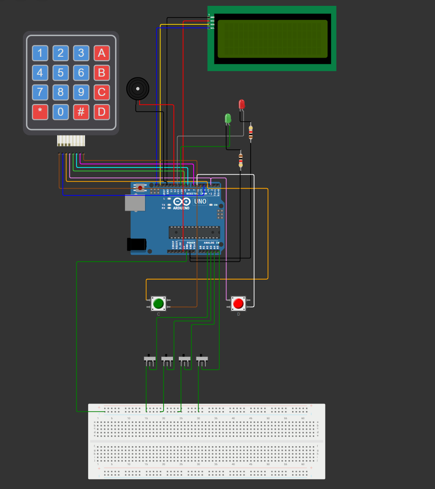

# 🚦 StrikeUnit

**StrikeUnit** ist ein modulares, Arduino-basiertes Spielmodul für Airsoft- und Paintball-Szenarien.  
Das System unterstützt mehrere Spielmodi (💣 Search & Destroy, 🛠️ Sabotage, 🏁 Domination, ✂️ Cut the Wire)  
und bietet zahlreiche Features wie LCD-Anzeige, Keypad, LED-Signalisierung, Sirene und MOSFET-gesteuerte Ausgänge.

---

## ✨ Features

- 💣 Mehrere Spielmodi (Search & Destroy, Sabotage, Domination, Cut the Wire)
- 🕹️ Bedienung über Tastenfeld & LCD-Display
- 🔐 Passwortschutz und flexible Code-Eingabe
- 🚨 LED-, Piezo- und Sirenen-Ausgänge
- 🧨 MOSFET-Steuerung für Pyro-Effekte oder externe Geräte
- 🧩 Modulare, gut strukturierte Codebasis
- 🔄 Einfache Erweiterung und Anpassung

---

## 🛠️ Hardware-Voraussetzungen

- 🧠 **Arduino** (Nano, Uno, Pro Mini empfohlen)
- 🖥️ **LCD-Display** (I2C oder parallel)
- ⌨️ **4x4 Keypad**
- 🔴 **LEDs**, **Piezo**, ggf. **Sirene**
- ⚡ **MOSFETs** für externe Ausgänge
- 🔊 **Lautsprecher** (optional)
- 🪛 Diverse Kabel und Kleinteile

---

## 🚀 Installation

1. 📥 Repository herunterladen oder klonen.
2. 📦 Abhängige Libraries installieren (z. B. Keypad, LiquidCrystal).
3. 🛠️ Hardware gemäß Schaltplan anschließen.
4. 💻 Code in Arduino IDE oder Visual Studio Code (mit PlatformIO) öffnen.
5. 🔌 Sketch auf den Arduino flashen.

---

## 🧪 Live-Demo

Teste das Projekt direkt im Browser mit Wokwi:  

👉 [StrikeUnit online testen (Wokwi.com)](https://wokwi.com/projects/431928489736753153)

---

## 🎮 Spielmodi Übersicht

- **💣 Search & Destroy:** Bombe legen & entschärfen
- **🛠️ Sabotage:** Ziel sabotieren & verteidigen
- **🏁 Domination:** Zonenbesetzung mit Timer
- **✂️ Cut the Wire:** Drahtfarbenrätsel

---

## 📝 Anpassung

Alle Texte und Menüeinträge findest du zentral in `lang.h`.  
Die Spielmodi sind modular als eigene `.ino`-Dateien organisiert – ideal zum Erweitern.

---

## 🙏 Credits & Originalprojekt

Dieses Projekt basiert auf [yinbot/Airsoft-BombPro](https://github.com/yinbot/Airsoft-BombPro).  
**Vielen Dank** an das Originalprojekt und die ursprünglichen Entwickler!

---

## 📝 Lizenz

MIT License

---

## 👤 Autor

D.  
GitHub: [s0n11c39]  
